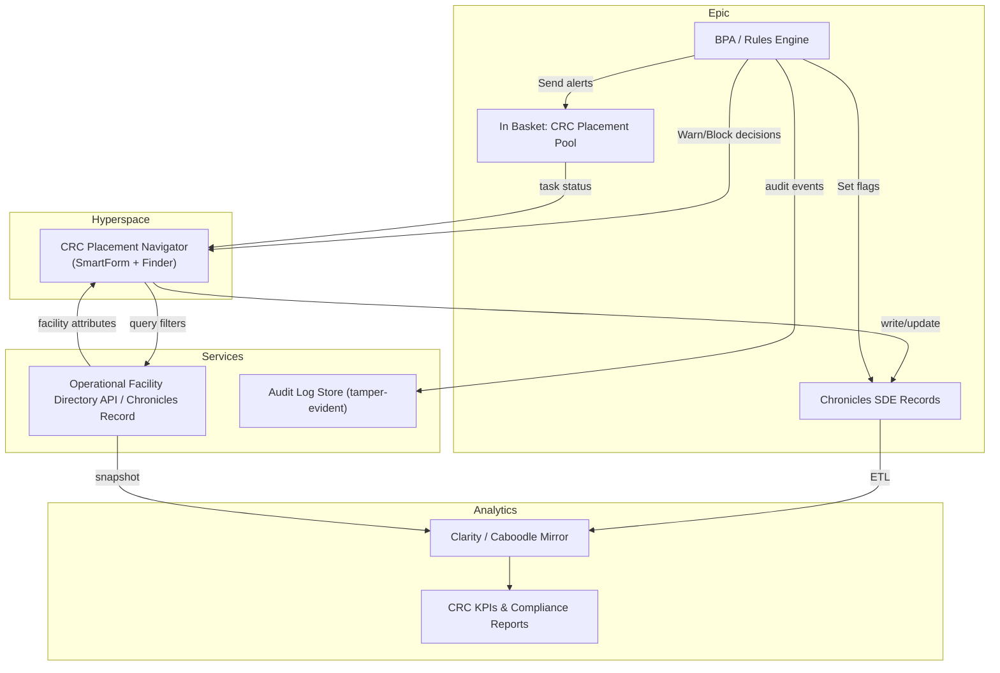

# Expected API & Routing Map (Derived from PRD)

## Narrative
- **Navigator / SmartForm** (Hyperspace) captures SSOT note fields (`PlacementNeeded`, `MAT_Needs`, `ASAM_Requested`, etc.) and writes to SDEs in Chronicles.  
- **Facility Directory Service** (operational API or Chronicles records) exposes search endpoints filtered by MAT, 302 capability, acuity, payer, and verification staleness.  
- **Rules Engine / BPA** evaluates selection validation and toxicology triggers, raising blocks/warns and In Basket messages.  
- **In Basket Routing** sends reassessment and override tasks to the CRC Placement pool with audit context.  
- **Reporting** replicates data to Clarity/Caboodle for KPIs, audits, and compliance reporting.

## Mermaid Overview

## Route / Action Checklist
| Surface | Route / Action | Auth Expectations | Notes |
| --- | --- | --- | --- |
| SmartForm | Save SSOT note | CRC Placement role + Break-the-glass (Part 2) | Must validate MAT, 302, acuity before commit; log overrides. |
| Finder | `/facilities/search` (filters: MAT, 302, acuity, payer, bed status, staleness) | CRC Placement role (read-only) | Response must redact PHI; include staleness metadata. |
| Finder | `/facilities/{id}/select` | CRC Placement role with override reason when block triggered | Writes `FACILITY_SELECTED_ID/TS`, captures audit. |
| Rules | `toxicity/check` | Background service | Raises reassessment flags; cross-check methodology. |
| In Basket | `tasks/create` | System account scoped to Placement pool | Must omit PHI in message body; include encounter reference only. |

*No live endpoints discovered; map will be validated once Epic and service repositories are provided.*
