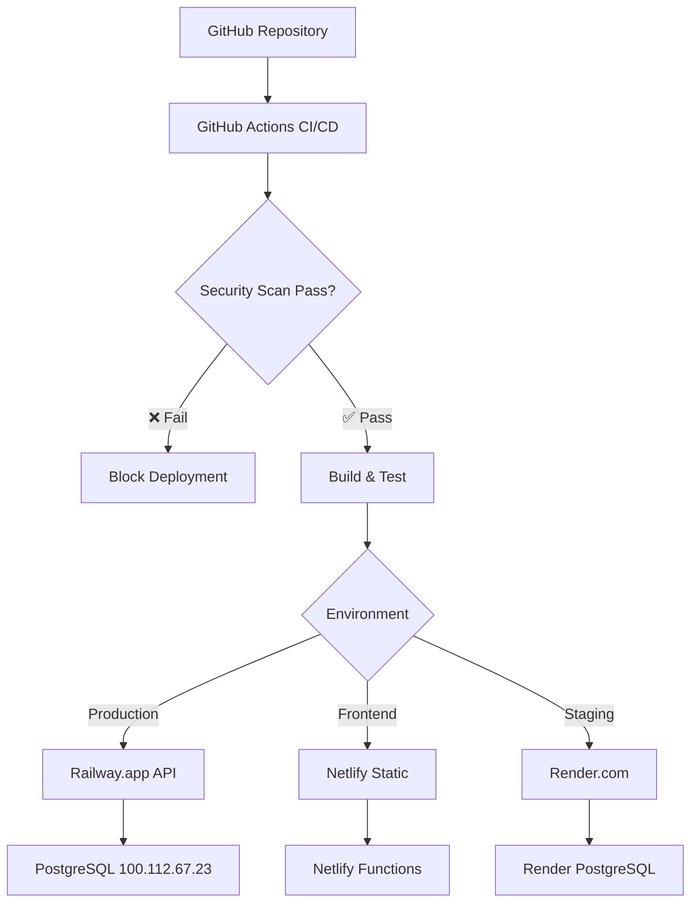

# 🚀 EMR CRC SSOT - Deployment Guide (SSOT)

**Last Updated**: September 29, 2025  
**Deployment Management**: Multi-platform deployment guide

## 🚨 UPDATE REQUIREMENTS

**MANDATORY**: Update this file whenever:

- ✅ New deployment platform added
- ✅ Deployment steps change
- ✅ Environment configuration updated
- ✅ Security requirements change
- ✅ Rollback procedures updated
- ✅ Health check endpoints change

## 🎯 Deployment Overview

### Supported Platforms

| Platform | Environment | Database | CI/CD | Status |
|----------|-------------|----------|-------|--------|
| Railway.app | Production | Remote PostgreSQL | GitHub Actions | ✅ Active |
| Netlify | UI Frontend | Serverless Functions | Git Deploy | ✅ Active |
| Render.com | Staging | Managed PostgreSQL | Auto Deploy | 🔄 Available |
| Local Docker | Development | Local PostgreSQL | Manual | 🔄 Available |

### Deployment Architecture



## 🏥 Production Deployment (Railway.app)

### Prerequisites

- Railway.app account with CLI installed
- PostgreSQL database accessible from Railway
- GitHub repository connected
- Environment secrets configured

### Step 1: Initial Railway Setup

```bash
# Install Railway CLI
npm install -g @railway/cli

# Login to Railway
railway login

# Create new project
railway create emr-crc-ssot-api

# Link to existing project
railway link [PROJECT-ID]
```

### Step 2: Environment Configuration

```bash
# Set production environment variables
railway variables set DB_HOST="100.112.67.23"
railway variables set DB_PORT="5432"
railway variables set DB_NAME="emr_crc_ssot"
railway variables set DB_USER="emr_admin"
railway variables set DB_PASSWORD="[SECURE_PASSWORD]"
railway variables set JWT_SECRET="[GENERATED_SECRET]"
railway variables set SESSION_SECRET="[GENERATED_SECRET]"
railway variables set NODE_ENV="production"
railway variables set API_PORT="3001"
```

### Step 3: Database Configuration

**Critical**: Database IP whitelist must include Railway's IPs:

```sql
-- Update PostgreSQL pg_hba.conf
host emr_crc_ssot emr_admin 0.0.0.0/0 md5

-- Or specific Railway IP ranges (recommended)
host emr_crc_ssot emr_admin 44.195.64.0/20 md5
host emr_crc_ssot emr_admin 52.86.50.0/23 md5
```

### Step 4: Deploy to Railway

```bash
# Deploy from local
railway up

# Deploy from GitHub (recommended)
railway connect [GITHUB_REPO]
```

### Step 5: Verify Deployment

```bash
# Check deployment status
railway status

# View logs
railway logs

# Test health endpoint
curl https://your-railway-url.up.railway.app/api/health
```

### Expected Health Response

```json
{
  "status": "healthy",
  "timestamp": "2025-09-29T10:00:00Z",
  "database": "connected",
  "version": "1.0.0",
  "environment": "production"
}
```

## 🌐 Frontend Deployment (Netlify)

### Prerequisites

- Netlify account
- GitHub repository connected
- Build configuration ready

### Step 1: Netlify Setup

**Via Netlify Dashboard:**

1. Connect GitHub repository
2. Set build command: `npm run build`
3. Set publish directory: `dist`
4. Set base directory: `development/prototypes/ui_prototype`

### Step 2: Environment Variables

```bash
# Netlify environment variables (dashboard or CLI)
VITE_API_URL=https://your-railway-url.up.railway.app
VITE_NODE_ENV=production
VITE_ENABLE_PLACEMENT_SEARCH=true
VITE_ENABLE_ASSESSMENT_MODULE=true
VITE_ENABLE_FACILITY_FINDER=true
```

### Step 3: Build Configuration

Create `netlify.toml` in repository root:

```toml
[build]
  base = "development/prototypes/ui_prototype"
  command = "npm run build"
  publish = "dist"

[build.environment]
  NODE_VERSION = "18"

[[redirects]]
  from = "/api/*"
  to = "https://your-railway-url.up.railway.app/api/:splat"
  status = 200

[[redirects]]
  from = "/*"
  to = "/index.html"
  status = 200
```

### Step 4: Deploy

```bash
# Via Git push (auto-deploy)
git push origin main

# Via Netlify CLI
npm install -g netlify-cli
netlify login
netlify deploy --prod
```

### Step 5: Verify Frontend

- Visit deployed URL
- Test API connectivity
- Verify environment variables
- Check console for errors

## 🧪 Staging Deployment (Render.com)

### Prerequisites

- Render.com account
- GitHub repository access
- Separate staging database (recommended)

### Step 1: Render Setup

**Via Render Dashboard:**

1. Create new Web Service
2. Connect GitHub repository
3. Set root directory: `production/api`
4. Set build command: `npm install`
5. Set start command: `npm start`

### Step 2: Environment Configuration

```bash
# Render environment variables
NODE_ENV=staging
DB_HOST=[STAGING_DB_HOST]
DB_NAME=emr_crc_ssot_staging
API_PORT=10000
# ... other variables
```

### Step 3: Database Setup

**Option A: Render PostgreSQL**

```bash
# Create managed PostgreSQL
# Use connection details in environment
```

**Option B: External Database**

```bash
# Use separate staging database
DB_HOST=your-staging-db.com
DB_NAME=emr_crc_ssot_staging
```

## 🐳 Local Docker Deployment

### Prerequisites

- Docker and Docker Compose installed
- Local PostgreSQL database
- Environment configuration

### Step 1: Docker Configuration

Create `docker-compose.yml`:

```yaml
version: '3.8'
services:
  api:
    build: 
      context: ./production/api
      dockerfile: Dockerfile
    ports:
      - "3001:3001"
    environment:
      - NODE_ENV=development
      - DB_HOST=postgres
      - DB_NAME=emr_crc_ssot
      - DB_USER=postgres
      - DB_PASSWORD=password
    depends_on:
      - postgres
    volumes:
      - ./production/api:/app
      - /app/node_modules

  ui:
    build:
      context: ./development/prototypes/ui_prototype
      dockerfile: Dockerfile
    ports:
      - "5174:5174"
    environment:
      - VITE_API_URL=http://localhost:3001
    volumes:
      - ./development/prototypes/ui_prototype:/app
      - /app/node_modules

  postgres:
    image: postgres:15
    environment:
      - POSTGRES_DB=emr_crc_ssot
      - POSTGRES_USER=postgres
      - POSTGRES_PASSWORD=password
    ports:
      - "5432:5432"
    volumes:
      - postgres_data:/var/lib/postgresql/data
      - ./database/init:/docker-entrypoint-initdb.d

volumes:
  postgres_data:
```

### Step 2: Build and Deploy

```bash
# Build images
docker-compose build

# Start services
docker-compose up -d

# View logs
docker-compose logs -f

# Stop services
docker-compose down
```

## 🔄 CI/CD Pipeline (GitHub Actions)

### Workflow Configuration

Create `.github/workflows/deploy.yml`:

```yaml
name: Deploy to Production

on:
  push:
    branches: [ main ]
  pull_request:
    branches: [ main ]

jobs:
  security-scan:
    runs-on: ubuntu-latest
    steps:
    - uses: actions/checkout@v3
    
    - name: Security Scan
      run: |
        chmod +x tools/security-scanner.sh
        ./tools/security-scanner.sh
    
    - name: Block if hardcoded values found
      if: failure()
      run: exit 1

  test:
    needs: security-scan
    runs-on: ubuntu-latest
    steps:
    - uses: actions/checkout@v3
    
    - name: Setup Node.js
      uses: actions/setup-node@v3
      with:
        node-version: '18'
    
    - name: Install dependencies
      run: npm ci
      working-directory: production/api
    
    - name: Run tests
      run: npm test
      working-directory: production/api

  deploy-api:
    needs: test
    runs-on: ubuntu-latest
    if: github.ref == 'refs/heads/main'
    steps:
    - uses: actions/checkout@v3
    
    - name: Deploy to Railway
      uses: railway/railway-action@v1
      with:
        railway-token: ${{ secrets.RAILWAY_TOKEN }}
        command: up

  deploy-ui:
    needs: security-scan
    runs-on: ubuntu-latest
    if: github.ref == 'refs/heads/main'
    steps:
    - uses: actions/checkout@v3
    
    - name: Deploy to Netlify
      uses: netlify/actions/build@v1
      with:
        publish-dir: development/prototypes/ui_prototype/dist
      env:
        NETLIFY_AUTH_TOKEN: ${{ secrets.NETLIFY_AUTH_TOKEN }}
        NETLIFY_SITE_ID: ${{ secrets.NETLIFY_SITE_ID }}
```

### Required Secrets

Add to GitHub repository secrets:

```bash
RAILWAY_TOKEN=your-railway-token
NETLIFY_AUTH_TOKEN=your-netlify-token  
NETLIFY_SITE_ID=your-netlify-site-id
DB_PASSWORD=your-production-db-password
JWT_SECRET=your-production-jwt-secret
SESSION_SECRET=your-production-session-secret
```

## 🛡️ Security Deployment Checklist

### Pre-Deployment Security

- [ ] Security scan passes
- [ ] No hardcoded credentials
- [ ] Environment variables configured
- [ ] HTTPS enabled
- [ ] Database connections secured
- [ ] Secrets properly managed
- [ ] HIPAA compliance verified

### Post-Deployment Security

- [ ] Health checks pass
- [ ] SSL certificate valid
- [ ] Database connection encrypted
- [ ] Audit logging enabled
- [ ] Error tracking configured
- [ ] Monitoring alerts active

## 🩺 Health Checks & Monitoring

### Health Check Endpoints

```bash
# API Health Check
GET /api/health
Response: {"status": "healthy", "database": "connected"}

# Database Health Check  
GET /api/health/database
Response: {"status": "connected", "latency": "25ms"}

# System Health Check
GET /api/health/system  
Response: {"memory": "512MB", "uptime": "2h 15m"}
```

### Monitoring Integration

```javascript
// Health check implementation
app.get('/api/health', async (req, res) => {
  try {
    // Database connection test
    await pool.query('SELECT 1');
    
    res.json({
      status: 'healthy',
      timestamp: new Date().toISOString(),
      database: 'connected',
      version: process.env.npm_package_version,
      environment: process.env.NODE_ENV
    });
  } catch (error) {
    res.status(503).json({
      status: 'unhealthy',
      error: error.message,
      timestamp: new Date().toISOString()
    });
  }
});
```

## 🚨 Rollback Procedures

### Automatic Rollback Triggers

- Health check failures > 5 minutes
- Error rate > 5% for 2 minutes  
- Database connection failures
- Security scan failures

### Manual Rollback Steps

**Railway Rollback:**

```bash
# List deployments
railway deployments

# Rollback to previous deployment
railway rollback [DEPLOYMENT-ID]

# Verify rollback
railway logs
```

**Netlify Rollback:**

```bash
# List deployments
netlify sites:list

# Rollback to previous version
netlify api restoreSiteDeploy --site-id [SITE-ID] --deploy-id [DEPLOY-ID]
```

### Database Rollback

```sql
-- If schema changes were made, run migration rollback
-- Backup current state first
pg_dump emr_crc_ssot > backup_before_rollback.sql

-- Apply previous schema version
-- (Maintain migration scripts for rollback)
```

## 🧪 Testing Deployments

### Deployment Testing Checklist

**API Testing:**

- [ ] Health endpoint responds
- [ ] Database connection works
- [ ] Authentication endpoints work
- [ ] CRUD operations function
- [ ] Error handling works

**UI Testing:**

- [ ] Application loads
- [ ] API calls succeed
- [ ] Authentication flow works
- [ ] Critical user paths work
- [ ] Mobile responsiveness

**Integration Testing:**

- [ ] API-UI communication
- [ ] Database persistence
- [ ] External system integration
- [ ] Error boundary handling

### Load Testing

```bash
# Simple load test with curl
for i in {1..100}; do
  curl -s -o /dev/null -w "%{http_code}\n" https://your-api.com/health
done

# Advanced load testing with artillery
npm install -g artillery
artillery quick --count 10 --num 5 https://your-api.com/health
```

## 📊 Deployment Metrics

### Key Performance Indicators

| Metric | Target | Alert Threshold |
|--------|--------|----------------|
| Deployment Success Rate | > 95% | < 90% |
| Rollback Rate | < 5% | > 10% |
| Deploy Time | < 5 minutes | > 10 minutes |
| Health Check Response | < 200ms | > 500ms |
| Database Connection Time | < 100ms | > 300ms |

### Monitoring Dashboard

Track deployment metrics:

- Deployment frequency
- Success/failure rates
- Performance impact
- Error rates
- User impact

## 🆘 Troubleshooting Deployments

### Common Issues

**Issue**: "Database connection failed"

**Solutions**:

1. Check IP whitelist includes deployment platform IPs
2. Verify database credentials in environment variables
3. Test database connectivity from deployment platform
4. Check database server status

**Issue**: "Environment variable not found"

**Solutions**:

1. Verify all required variables are set
2. Check variable names match exactly
3. Ensure secrets are properly configured
4. Test with config validation script

**Issue**: "Build failed"

**Solutions**:

1. Check build logs for specific errors
2. Verify Node.js version compatibility
3. Check for missing dependencies
4. Test build locally first

**Issue**: "Health check failing"

**Solutions**:

1. Check application startup logs
2. Verify database connection
3. Test health endpoint manually
4. Check for missing environment variables

### Emergency Contacts

- **Database Issues**: Database Administrator
- **Deployment Platform**: Platform Support  
- **Security Issues**: Security Team
- **Healthcare Compliance**: Compliance Officer

---

**🔄 Last Updated**: September 29, 2025  
**✅ Deployment Status**: All platforms operational  
**🚨 Next Update Required**: When deployment procedures change