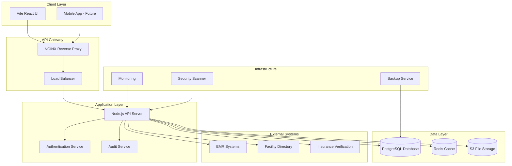
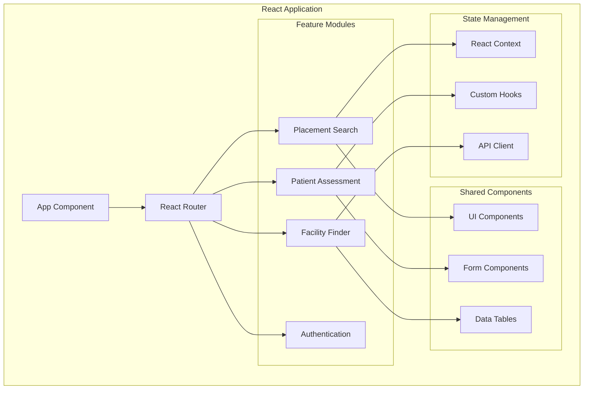
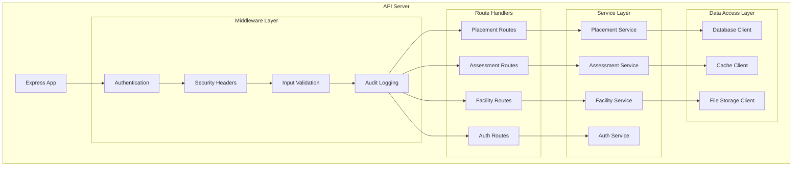
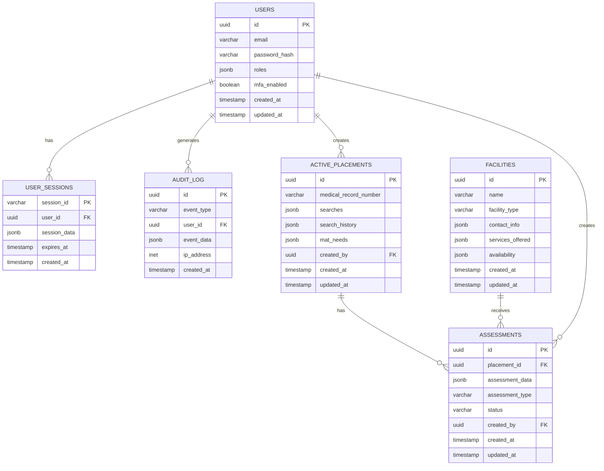
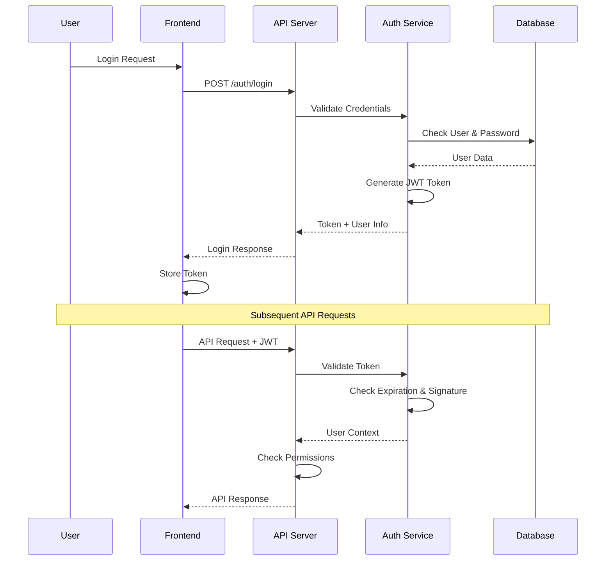
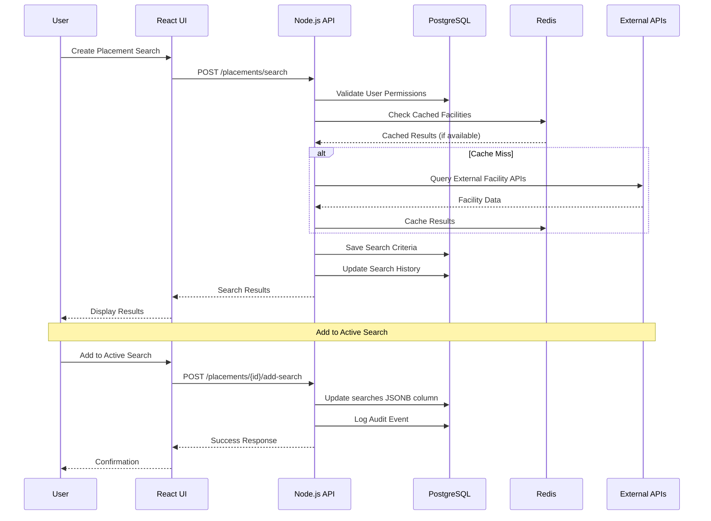
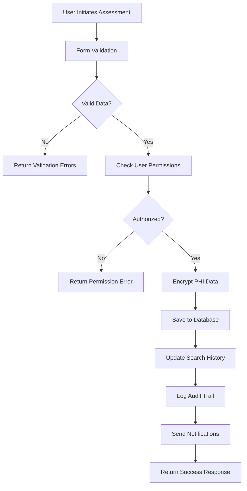
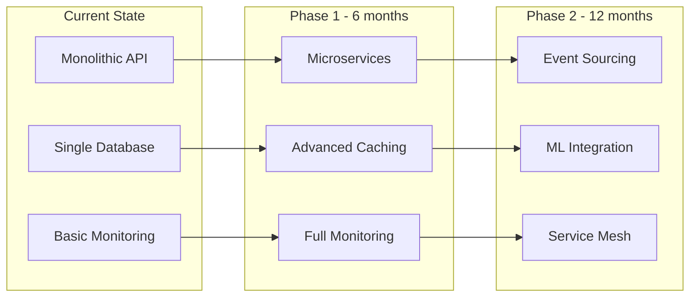

# 🏗️ EMR CRC SSOT - System Architecture (SSOT)

**Last Updated**: September 29, 2025  
**Architecture Classification**: Healthcare System Design

## 🚨 UPDATE REQUIREMENTS

**MANDATORY**: Update this file whenever:

- ✅ System components added/removed
- ✅ Data flow patterns change
- ✅ Infrastructure modifications
- ✅ Security architecture updates
- ✅ Integration patterns change
- ✅ Performance requirements updated

## 🎯 Architecture Overview

### System Purpose

The **EMR CRC SSOT (Electronic Medical Record - Crisis Response Coordination - Single Source of Truth)** system manages healthcare placement coordination, patient assessments, and facility matching for crisis response situations.

### Core Capabilities

- **Active Placement Searches**: Persistent search management for patient placement
- **Patient Assessments**: Comprehensive healthcare evaluations  
- **Facility Finder**: Healthcare facility discovery and matching
- **HIPAA Compliance**: Full healthcare data protection
- **Real-time Coordination**: Live updates and notifications

## 🏗️ High-Level Architecture



### Technology Stack

| Layer | Technology | Purpose | Version |
|-------|------------|---------|---------|
| **Frontend** | Vite + React | User Interface | Vite 4.x, React 18.x |
| **Backend** | Node.js + Express | API Server | Node 18.x, Express 4.x |
| **Database** | PostgreSQL | Primary Data Store | PostgreSQL 15.x |
| **Cache** | Redis | Session & Data Cache | Redis 7.x |
| **File Storage** | AWS S3 | Document Storage | S3 API v2 |
| **Security** | Helmet, bcrypt, JWT | Security Controls | Latest |
| **Monitoring** | Custom + Health Checks | System Monitoring | Custom |

## 🔧 Component Architecture

### Frontend Architecture (React + Vite)



**Frontend Structure**:

```
development/prototypes/ui_prototype/
├── src/
│   ├── components/          # Reusable UI components
│   │   ├── common/         # Shared components
│   │   ├── forms/          # Form components
│   │   └── tables/         # Data display components
│   ├── pages/              # Page components
│   │   ├── PlacementSearch.jsx
│   │   ├── Assessment.jsx
│   │   ├── FacilityFinder.jsx
│   │   └── Auth/
│   ├── hooks/              # Custom React hooks
│   ├── context/            # React Context providers
│   ├── services/           # API client services
│   ├── utils/              # Utility functions
│   └── styles/             # CSS/styling
├── public/                 # Static assets
└── package.json           # Dependencies
```

### Backend Architecture (Node.js + Express)



**Backend Structure**:

```
production/api/
├── src/
│   ├── routes/             # API route definitions
│   │   ├── placements.js
│   │   ├── assessments.js
│   │   ├── facilities.js
│   │   └── auth.js
│   ├── services/           # Business logic services
│   │   ├── PlacementService.js
│   │   ├── AssessmentService.js
│   │   └── FacilityService.js
│   ├── middleware/         # Express middleware
│   │   ├── auth.js
│   │   ├── validation.js
│   │   └── audit.js
│   ├── models/             # Data models
│   ├── database/           # Database configuration
│   ├── utils/              # Utility functions
│   └── config/             # Configuration files
├── logs/                   # Log files
└── package.json           # Dependencies
```

## 💾 Data Architecture

### Database Schema Design



### Data Storage Patterns

**JSONB Usage**:

```javascript
// Active Placement Search Structure
{
  "id": "uuid-here",
  "medical_record_number": "MRN12345678",
  "searches": {
    "current_search": {
      "criteria": {
        "facility_type": "acute_care",
        "service_needs": ["psychiatric", "medical"],
        "insurance": "medicaid",
        "location_preference": "within_50_miles"
      },
      "status": "active",
      "created_at": "2025-09-29T10:00:00Z"
    },
    "saved_searches": [
      {
        "name": "Emergency Psych Placement",
        "criteria": { /* search criteria */ },
        "created_at": "2025-09-29T09:00:00Z"
      }
    ]
  },
  "search_history": [
    {
      "search_id": "search-uuid",
      "executed_at": "2025-09-29T10:15:00Z",
      "results_count": 5,
      "facilities_contacted": ["facility-1", "facility-2"]
    }
  ],
  "mat_needs": {
    "medication_assisted_treatment": {
      "required": true,
      "substances": ["opioid", "alcohol"],
      "current_medications": [
        {
          "name": "buprenorphine",
          "dosage": "8mg daily",
          "prescriber": "Dr. Smith"
        }
      ]
    }
  }
}
```

### Caching Strategy

```javascript
// Redis Caching Layers
const cacheConfig = {
  // User sessions (30 minutes)
  sessions: {
    prefix: 'sess:',
    ttl: 1800
  },
  
  // API responses (5 minutes)
  api_cache: {
    prefix: 'api:',
    ttl: 300
  },
  
  // Facility data (1 hour)
  facilities: {
    prefix: 'facilities:',
    ttl: 3600
  },
  
  // Search results (15 minutes)
  search_results: {
    prefix: 'search:',
    ttl: 900
  }
};

// Cache implementation
class CacheService {
  async get(key) {
    const data = await redis.get(key);
    return data ? JSON.parse(data) : null;
  }
  
  async set(key, data, ttl = 300) {
    await redis.setex(key, ttl, JSON.stringify(data));
  }
  
  async invalidate(pattern) {
    const keys = await redis.keys(pattern);
    if (keys.length > 0) {
      await redis.del(...keys);
    }
  }
}
```

## 🔐 Security Architecture

### Authentication & Authorization Flow



### Data Encryption Layers

```javascript
// Multi-layer encryption strategy
const encryptionLayers = {
  // Database level (PostgreSQL TDE)
  database: {
    type: 'transparent_data_encryption',
    algorithm: 'AES-256',
    scope: 'entire_database'
  },
  
  // Column level (PHI data)
  column: {
    type: 'pgcrypto',
    algorithm: 'AES-256-GCM',
    scope: 'phi_columns'
  },
  
  // Application level (sensitive fields)
  application: {
    type: 'field_encryption',
    algorithm: 'AES-256-GCM',
    scope: 'sensitive_data'
  },
  
  // Transport level (HTTPS/TLS)
  transport: {
    type: 'tls_1_3',
    cipher_suite: 'TLS_AES_256_GCM_SHA384',
    scope: 'all_network_traffic'
  }
};
```

## 🔄 Data Flow Patterns

### Placement Search Flow



### Assessment Creation Flow



## ⚡ Performance Architecture

### Scalability Patterns

```javascript
// Connection pooling configuration
const poolConfig = {
  // PostgreSQL connection pool
  database: {
    host: process.env.DB_HOST,
    port: process.env.DB_PORT,
    database: process.env.DB_NAME,
    user: process.env.DB_USER,
    password: process.env.DB_PASSWORD,
    max: 20,                    // Maximum pool size
    idleTimeoutMillis: 30000,   // Close idle connections after 30 seconds
    connectionTimeoutMillis: 2000, // Timeout after 2 seconds
    ssl: process.env.NODE_ENV === 'production'
  },
  
  // Redis connection pool
  redis: {
    host: process.env.REDIS_HOST,
    port: process.env.REDIS_PORT,
    password: process.env.REDIS_PASSWORD,
    maxRetriesPerRequest: 3,
    retryDelayOnFailover: 100,
    lazyConnect: true
  }
};

// Load balancing strategy (for future scaling)
const loadBalancerConfig = {
  algorithm: 'round_robin',
  health_check: {
    path: '/api/health',
    interval: 30, // seconds
    timeout: 5    // seconds
  },
  servers: [
    { host: 'api-1.healthcare.com', port: 3001 },
    { host: 'api-2.healthcare.com', port: 3001 }
  ]
};
```

### Database Performance Optimization

```sql
-- Critical indexes for performance
CREATE INDEX CONCURRENTLY idx_active_placements_searches_gin
ON active_placements USING gin(searches);

CREATE INDEX CONCURRENTLY idx_active_placements_created_at
ON active_placements(created_at DESC);

CREATE INDEX CONCURRENTLY idx_audit_log_user_timestamp
ON audit_log(user_id, created_at DESC);

CREATE INDEX CONCURRENTLY idx_facilities_services_gin
ON facilities USING gin(services_offered);

-- Query optimization examples
EXPLAIN ANALYZE 
SELECT * FROM active_placements 
WHERE searches @> '{"current_search": {"status": "active"}}';

-- Materialized view for complex queries
CREATE MATERIALIZED VIEW active_placement_summary AS
SELECT 
    id,
    medical_record_number,
    searches->>'current_search'->>'status' as search_status,
    created_at,
    updated_at
FROM active_placements
WHERE searches->>'current_search'->>'status' = 'active';

-- Refresh strategy
REFRESH MATERIALIZED VIEW CONCURRENTLY active_placement_summary;
```

## 🚀 Deployment Architecture

### Multi-Environment Setup

```yaml
# Docker Compose for local development
version: '3.8'
services:
  api:
    build: ./production/api
    environment:
      - NODE_ENV=development
      - DB_HOST=postgres
    depends_on:
      - postgres
      - redis
    
  ui:
    build: ./development/prototypes/ui_prototype
    environment:
      - VITE_API_URL=http://api:3001
    depends_on:
      - api
    
  postgres:
    image: postgres:15
    environment:
      - POSTGRES_DB=emr_crc_ssot
    volumes:
      - postgres_data:/var/lib/postgresql/data
    
  redis:
    image: redis:7-alpine
    volumes:
      - redis_data:/data

volumes:
  postgres_data:
  redis_data:
```

### Cloud Deployment Strategy

| Environment | Platform | Database | Monitoring |
|-------------|----------|----------|------------|
| **Development** | Local Docker | Local PostgreSQL | Console logs |
| **Staging** | Render.com | Render PostgreSQL | Basic monitoring |
| **Production** | Railway.app | Remote PostgreSQL | Full monitoring |

## 📊 Monitoring & Observability

### Health Check Architecture

```javascript
// Comprehensive health check system
class HealthCheckService {
  async getSystemHealth() {
    const checks = await Promise.allSettled([
      this.checkDatabase(),
      this.checkRedis(),
      this.checkExternalAPIs(),
      this.checkFileSystem(),
      this.checkMemoryUsage()
    ]);
    
    return {
      timestamp: new Date().toISOString(),
      status: checks.every(c => c.status === 'fulfilled') ? 'healthy' : 'degraded',
      checks: {
        database: checks[0].status === 'fulfilled' ? 'healthy' : 'unhealthy',
        redis: checks[1].status === 'fulfilled' ? 'healthy' : 'unhealthy',
        external_apis: checks[2].status === 'fulfilled' ? 'healthy' : 'degraded',
        file_system: checks[3].status === 'fulfilled' ? 'healthy' : 'unhealthy',
        memory: checks[4].status === 'fulfilled' ? 'healthy' : 'high'
      },
      metrics: {
        uptime: process.uptime(),
        memory_usage: process.memoryUsage(),
        active_connections: await this.getActiveConnections()
      }
    };
  }
}
```

### Logging Architecture

```javascript
// Structured logging configuration
const loggingConfig = {
  levels: {
    error: 0,
    warn: 1,
    info: 2,
    http: 3,
    debug: 4
  },
  
  transports: [
    // Console logging for development
    new winston.transports.Console({
      format: winston.format.combine(
        winston.format.colorize(),
        winston.format.simple()
      )
    }),
    
    // File logging for production
    new winston.transports.File({
      filename: 'logs/error.log',
      level: 'error',
      format: winston.format.json()
    }),
    
    // Audit logging (separate from application logs)
    new winston.transports.File({
      filename: 'logs/audit.log',
      format: winston.format.json()
    })
  ]
};
```

## 🔮 Future Architecture Considerations

### Planned Enhancements

1. **Microservices Migration**
   - Split monolithic API into domain services
   - Implement service mesh for communication
   - Add distributed tracing

2. **Event-Driven Architecture**
   - Implement event sourcing for audit trail
   - Add message queue for async processing
   - Enable real-time notifications

3. **Advanced Caching**
   - Implement distributed caching with Redis Cluster
   - Add CDN for static assets
   - Implement query result caching

4. **Machine Learning Integration**
   - Predictive placement matching
   - Automated risk assessment
   - Natural language processing for assessments

### Technology Evolution Path



---

**🔄 Last Updated**: September 29, 2025  
**✅ Architecture Status**: Current implementation documented  
**🚨 Next Update Required**: When system components or patterns change